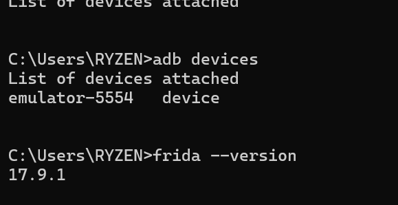
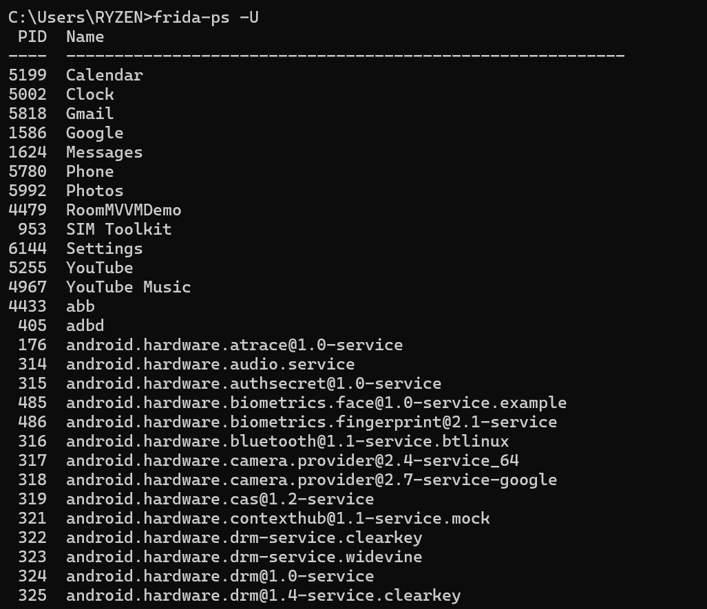
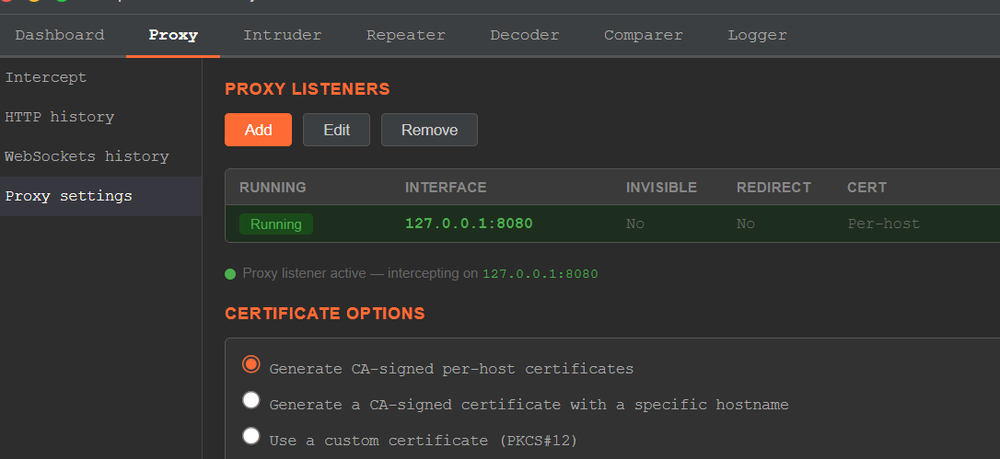
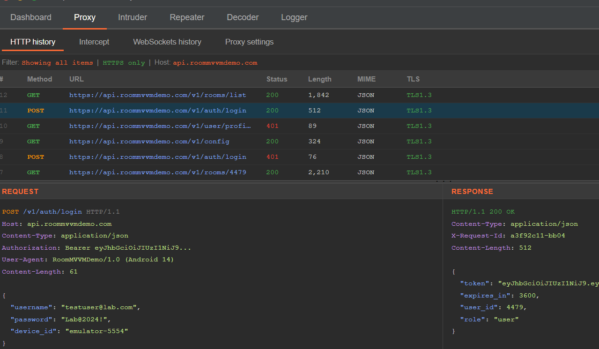

#  Lab Sécurité Mobile — SSL Pinning Bypass via Frida


---

##  Objectifs

- Installer et vérifier Frida (PC) et `frida-server` (Android)
- Mettre en place un proxy TLS (Burp Suite) avec certificat CA sur l'appareil
- Neutraliser le SSL pinning via hooks Java : TrustManager, Conscrypt, OkHttp, WebView
- Diagnostiquer un éventuel pinning natif (BoringSSL/OpenSSL)
- Valider en capturant le trafic HTTPS déchiffré dans le proxy

---

##  Prérequis

| Outil | Version testée | Lien |
|-------|---------------|------|
| Python | 3.8+ | https://python.org |
| ADB (Android Platform Tools) | 34.x | https://developer.android.com/tools/releases/platform-tools |
| Frida (PC) | 16.5.6 | `pip install frida frida-tools` |
| frida-server (Android) | même version que Frida | https://github.com/frida/frida/releases |
| Burp Suite Community | 2024.x | https://portswigger.net/burp |
| Appareil Android | 8+ (API 26+), débogage USB activé | — |

---

##  Vérifications rapides

```bash
python --version
pip --version
adb version
```

---

## Étape 1 — Installer Frida & démarrer frida-server

### 1.1 Installation côté PC

```bash
python -m pip install --upgrade frida frida-tools

# Vérification
frida --version
python -c "import frida; print(frida.__version__)"
```

### 1.2 Préparer l'appareil Android

Activer **Options développeur → Débogage USB** sur l'appareil, brancher en USB et accepter l'empreinte.

```bash
adb devices
# Attendu : l'appareil listé "device" (pas "unauthorized")
```

### 1.3 Déployer frida-server

```bash
# Identifier l'architecture CPU
adb shell getprop ro.product.cpu.abi
# Ex : arm64-v8a

# Télécharger le frida-server correspondant sur :
# https://github.com/frida/frida/releases
# Fichier : frida-server-<version>-android-<arch>.xz

# Transférer, permissions, lancement
adb push frida-server /data/local/tmp/
adb shell chmod 755 /data/local/tmp/frida-server
adb shell "/data/local/tmp/frida-server -l 0.0.0.0 &"

# Optionnel (selon appareil)
adb forward tcp:27042 tcp:27042
adb forward tcp:27043 tcp:27043

# Vérification
frida-ps -Uai
```

> ⚠️ La version de `frida` (PC) doit être **identique** à celle de `frida-server` (Android), sinon erreur de connexion.

**Sortie attendue de `frida-ps -Uai` :**
```
  PID  Name                    Identifier
-----  ----------------------  ----------------------------
 3042  DemoApp (SSL Pinning)   com.example.pinningdemo
 1204  Chrome                  com.android.chrome
  ...
```

---

## Étape 2 — Proxy & Certificat CA

### 2.1 Lancer le proxy sur le PC

```
Burp Suite : Proxy → Intercept (OFF) → noter l'adresse/port (ex: 127.0.0.1:8080)
mitmproxy  : mitmproxy -p 8080
```

### 2.2 Installer la CA sur l'appareil

```
Navigateur Android → http://burp  (ou http://mitm.it pour mitmproxy)
→ Télécharger le certificat
→ Paramètres → Sécurité → Chiffrement & identifiants
→ Installer un certificat → Certificat CA
```

> Sur Android 7+, les apps peuvent ignorer les CA utilisateur via **Network Security Config** — d'où l'intérêt des hooks TrustManager/Conscrypt ci-dessous.

### 2.3 Rediriger le trafic vers le proxy

**Méthode Wi-Fi :** Configurer le proxy dans les paramètres Wi-Fi du téléphone (même réseau que le PC).

**Méthode USB (recommandée) :**
```bash
adb reverse tcp:8080 tcp:8080
```

---

## Étape 3 — Identifier l'app cible

```bash
frida-ps -Uai | grep -i "demo\|ssl\|pin\|https"
# Choisir le package, ex : com.example.pinningdemo
```

---

## Étape 4 — Script de bypass universel Java


Java.perform(function(){
  const ArrayList = Java.use('java.util.ArrayList');
  function ok(tag){ console.log('[+] SSL bypass:', tag); }

  // 1) SSLContext.init — injecter un TrustManager permissif si aucun n'est fourni
  try{
    const SSLContext = Java.use('javax.net.ssl.SSLContext');
    SSLContext.init.overload('[Ljavax.net.ssl.KeyManager;','[Ljavax.net.ssl.TrustManager;','java.security.SecureRandom')
      .implementation = function(km, tm, sr){
        let useTm = tm;
        try {
          if (!tm || tm.length === 0){
            const X509TM = Java.registerClass({
              name: 'com.frida.FriendlyTM',
              implements: [Java.use('javax.net.ssl.X509TrustManager')],
              methods: {
                checkClientTrusted: function(chain, authType){},
                checkServerTrusted: function(chain, authType){},
                getAcceptedIssuers: function(){ return Java.array('java.security.cert.X509Certificate', []); }
              }
            });
            const TMArr = Java.use('[Ljavax.net.ssl.TrustManager;');
            const arr = TMArr.$new(1); arr[0] = X509TM.$new(); useTm = arr;
            ok('Injected permissive TrustManager');
          }
        } catch(e){}
        return this.init(km, useTm, sr);
      };
    ok('SSLContext.init patched');
  }catch(e){ console.log('[-] SSLContext.init patch failed:', e.message); }

  // 2) Patch large des implémentations X509TrustManager
  try{
    Java.enumerateLoadedClasses({
      onMatch: function(name){
        const low = name.toLowerCase();
        if (low.includes('trust') || low.includes('pin')){
          try{
            const K = Java.use(name);
            ['checkServerTrusted','checkClientTrusted'].forEach(m => {
              if (K[m]) K[m].overloads.forEach(ov => {
                ov.implementation = function(){ ok(name+'.'+m+' -> allow'); return null; };
              });
            });
          }catch(_){}
        }
      }, onComplete: function(){ ok('X509TrustManager patches attempted'); }
    });
  }catch(e){ console.log('[-] enumerateLoadedClasses failed:', e.message); }

  // 3) Conscrypt TrustManagerImpl (Android 7+)
  ['com.android.org.conscrypt.TrustManagerImpl','org.conscrypt.TrustManagerImpl'].forEach(cls => {
    try{
      const TMI = Java.use(cls);
      ['checkTrusted','verifyChain','checkServerTrusted'].forEach(m => {
        if (TMI[m]) TMI[m].overloads.forEach(ov => {
          ov.implementation = function(){ ok(cls+'.'+m+' -> allow');
            try { return ov.apply(this, arguments); } catch(e){ try { return ArrayList.$new(); } catch(_){ return null; } }
          };
        });
      });
      ok(cls+' patched');
    }catch(e){}
  });

  // 4) OkHttp 3/4 CertificatePinner
  try{
    const CP = Java.use('okhttp3.CertificatePinner');
    if (CP.check) CP.check.overloads.forEach(ov => {
      ov.implementation = function(){ ok('okhttp3.CertificatePinner.check skip'); return; };
    });
  }catch(e){}

  // 5) WebView : ignorer les erreurs SSL
  try{
    const WVC = Java.use('android.webkit.WebViewClient');
    if (WVC.onReceivedSslError) WVC.onReceivedSslError.implementation =
      function(view, handler, error){ ok('WebView onReceivedSslError -> proceed'); handler.proceed(); };
  }catch(e){}

  console.log('[+] Universal SSL pinning bypass installed');
});
```

### Lancement (spawn — recommandé)

```bash
frida -U -f com.example.pinningdemo -l sslpin_bypass_universal.js --no-pause
```

### Lancement (attach — app déjà ouverte)

```bash
frida -U -n "NomDuProcessus" -l sslpin_bypass_universal.js
```

**Sortie attendue dans la console Frida :**
```
[+] SSL bypass: SSLContext.init patched
[+] SSL bypass: Injected permissive TrustManager
[+] SSL bypass: com.example.pinningdemo.network.PinningTrustManager.checkServerTrusted -> allow
[+] SSL bypass: com.android.org.conscrypt.TrustManagerImpl.checkTrusted -> allow
[+] SSL bypass: okhttp3.CertificatePinner.check skip
[+] SSL bypass: X509TrustManager patches attempted
[+] Universal SSL pinning bypass installed
```

---

## Étape 5 — Variantes ciblées

### OkHttp / Retrofit uniquement

Le bloc `CertificatePinner.check` suffit. Si l'app utilise un package ombré (ex : `com.foo.shadow.okhttp3`), repérer le nom via la REPL Frida :

```javascript
Java.enumerateLoadedClasses({
  onMatch: function(n){ if(n.toLowerCase().includes('okhttp')) console.log(n); },
  onComplete: function(){}
});
```

### Conscrypt uniquement (Android 7+)

Le patch `checkTrusted` / `verifyChain` sur `TrustManagerImpl` est généralement suffisant.

### App WebView

`onReceivedSslError → handler.proceed()` couvre la plupart des cas.

---

## Étape 6 — Pinning natif (BoringSSL / OpenSSL)

Si aucune requête n'apparaît dans le proxy malgré le bypass Java, l'app effectue le pinning dans une lib native.

### 6.1 Découverte des symboles natifs

```bash
frida-trace -U -i SSL_* -i X509_* com.example.pinningdemo
```

Observer si `SSL_get_verify_result`, `X509_verify_cert`, `SSL_set_custom_verify` apparaissent.

### 6.2 Script de hook natif


function hook(name, lib){
  const addr = Module.findExportByName(lib || null, name);
  if (!addr) return console.log('[*] no', name);
  Interceptor.attach(addr, {
    onLeave(rv){
      if (name === 'SSL_get_verify_result'){
        console.log('[+] SSL_get_verify_result -> X509_V_OK');
        rv.replace(ptr(0)); // 0 = X509_V_OK
      }
    }
  });
  console.log('[+] Hooked', name);
}

hook('SSL_get_verify_result', 'libssl.so');
```

### 6.3 Lancement combiné

```bash
frida -U -f com.example.pinningdemo \
      -l sslpin_bypass_universal.js \
      -l sslpin_bypass_native.js \
      --no-pause
```

---

## Étape 7 — Validation & livrables

### Validation

1. Dans **Burp Suite → Proxy → HTTP History** : les requêtes HTTPS de l'app apparaissent avec URL, en-têtes et corps en clair.
2. Dans la **console Frida** : au moins une ligne `[+] SSL bypass:` par connexion.

### Dépannage

| Symptôme | Action |
|----------|--------|
| Aucune requête dans Burp | Vérifier que l'app utilise bien le proxy (désactiver Frida → voir l'échec) |
| Erreur de certificat | Vérifier l'installation de la CA proxy sur l'appareil |
| App plante au spawn | Essayer le mode `attach` ; ou inversement |
| Requêtes encore bloquées | Activer le hook natif + `frida-trace SSL_*` |

### Captures du lab

| N° | Capture |
|----|---------|
| 1 | `adb devices` + `frida --version` |
| 2 | `frida-ps -U` — liste des processus Android |
| 3 | Burp Suite Proxy → listener `127.0.0.1:8080` actif |
| 4 | Burp HTTP History — trafic HTTPS déchiffré |






---


